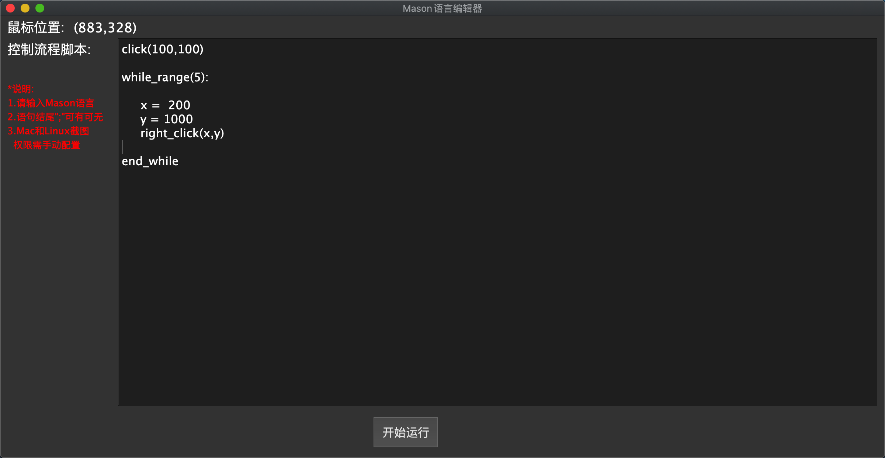

# Mason脚本语言语法
## v1.0版本暂定为 命令式
## 环境:C++11,Python>3.5,暂时只支持Mac OS与Linux,不支持windows
### 缩进写法 末尾";"可有可无
### 基本命令
### 关键字: click
#### 用法:click(1000,1000);&nbsp;&nbsp;&nbsp;&nbsp;&nbsp;&nbsp;在桌面上点击某一点
### 关键字: right_click
#### 用法:right_click(1000,1000);&nbsp;&nbsp;&nbsp;&nbsp;&nbsp;&nbsp;在桌面上右击某一点
### 关键字: double_click
#### 用法:double_click(1000,1000);&nbsp;&nbsp;&nbsp;&nbsp;&nbsp;&nbsp;在桌面上双击某一点
### 关键字: drag
#### 用法:drag(1000,1000,500,500);&nbsp;&nbsp;&nbsp;&nbsp;&nbsp;&nbsp;拖拽
### 关键字: input
#### 用法:input(123);&nbsp;&nbsp;&nbsp;&nbsp;&nbsp;&nbsp;输入的内容在括号里
#
### 高级
### 关键字: start_if
#### 用法:start_if(条件结果);&nbsp;&nbsp;&nbsp;&nbsp;&nbsp;&nbsp;条件分支,到end_if为止,中间要缩进,支持嵌套
### 关键字: end_if
#### 用法:end_if;&nbsp;&nbsp;&nbsp;&nbsp;&nbsp;&nbsp;条件分支结束
### 关键字: while_range
#### 用法:while_range(数字);&nbsp;&nbsp;&nbsp;&nbsp;&nbsp;&nbsp;循环语句,到end_while为止,中间要缩进,支持嵌套
### 关键字: end_while
#### 用法:end_while;&nbsp;&nbsp;&nbsp;&nbsp;&nbsp;&nbsp;循环体结束

## 说明:
### 取消for循环
### 变量的声明和函数调用在v2.0,并提供Mason语言标准库
### 最好用记事本写,编辑器在打造中

